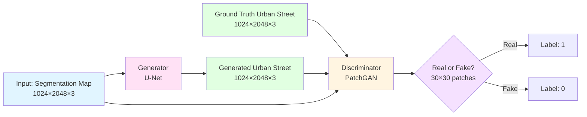
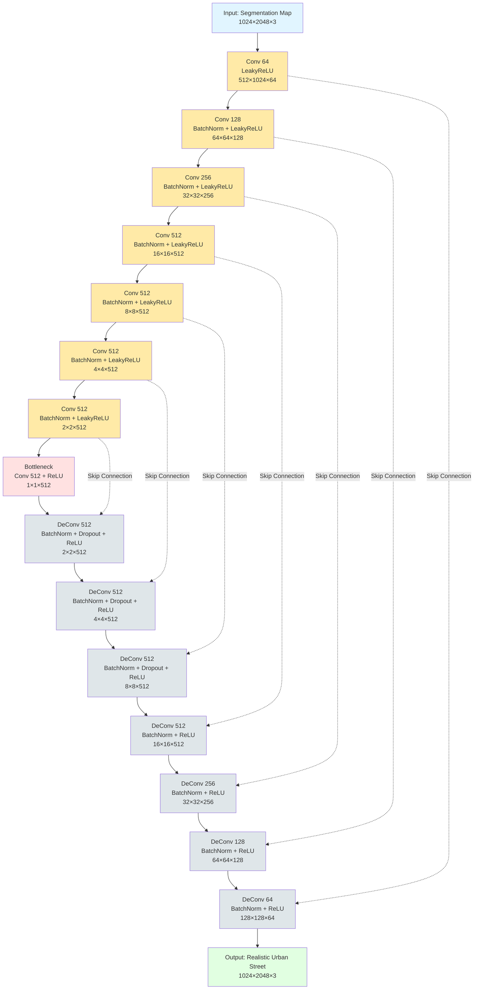
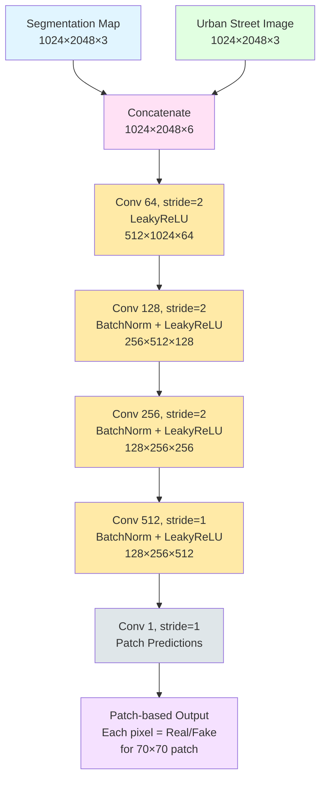
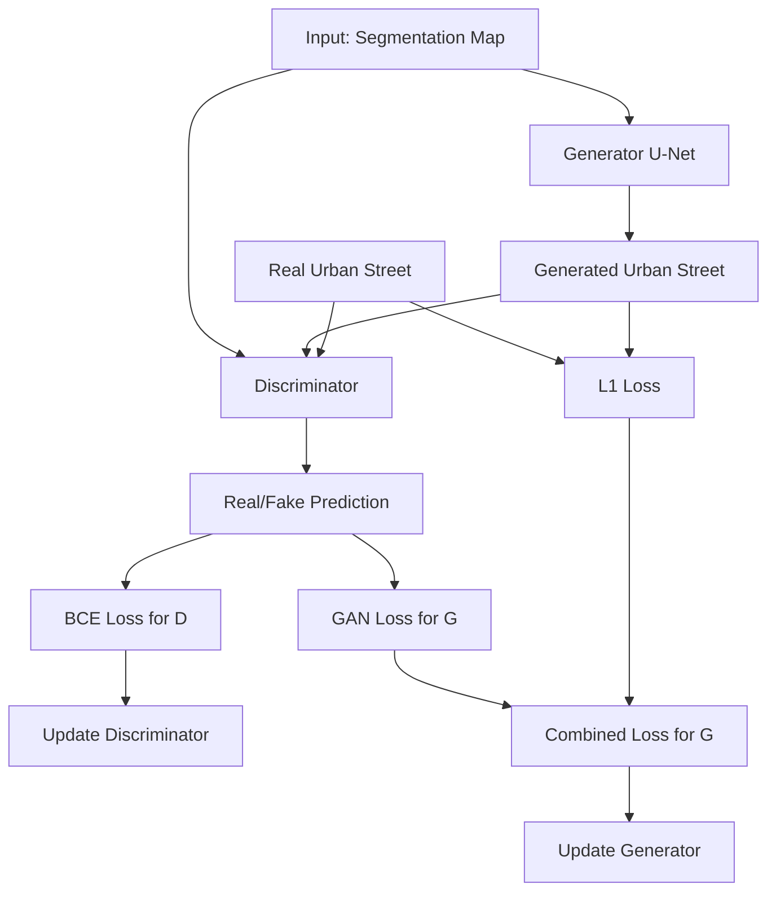
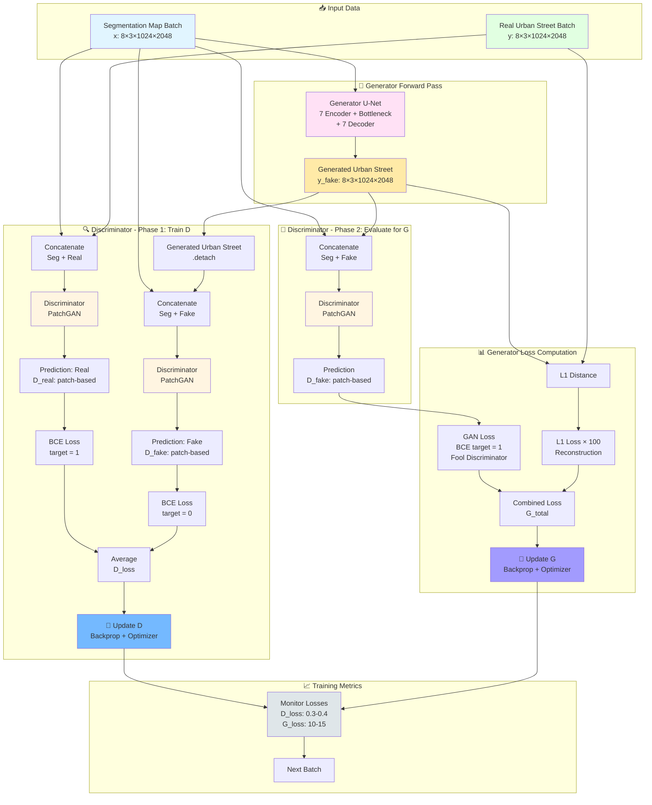
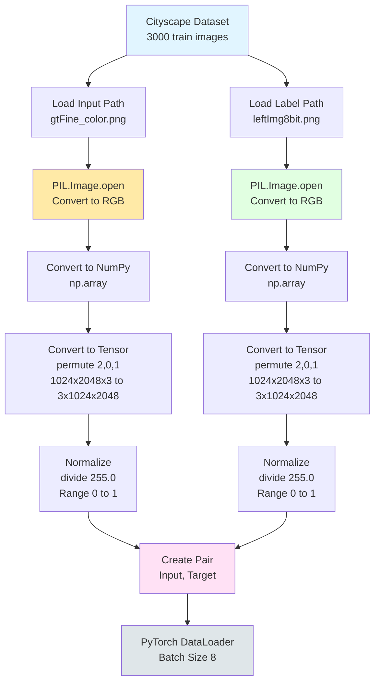

# รายงานโครงการสุดท้าย (Final Project Report)
## วิชา 204466 การเรียนรู้เชิงลึก (Deep Learning)

---

## ชื่อโปรเจค
**Segmented Urban Street to Realistic Urban Street with Pix2Pix GauGANs**

*A take on Nvidia's GauGANs with pix2pix architecture and urban street dataset*

---


**การแบ่งงาน:**
- สมาชิกคนที่ 1 (50%): Dataset Preparation & Organization, Model Architecture Development
- สมาชิกคนที่ 2 (50%): Model Training & Optimization, Evaluation, Documentation

---

## 1. บทนำและความน่าสนใจของโปรเจค
<div style="display: flex; gap: 20px; justify-content: center; flex-wrap: nowrap;">

  <div style="text-align: center;">
    <p><strong>Input</strong></p>
    
  </div>

  <div style="text-align: center;">
    <p><strong>Output</strong></p>
    
  </div>

  <div style="text-align: center;">
    <p><strong>Ground Truth</strong></p>
    
  </div>

</div>


### 1.1 ที่มาและความสำคัญ

โปรเจค Seg2Scene เป็นการนำเทคโนโลยี Deep Learning มาประยุกต์ใช้ในการแปลงภาพ Semantic Segmentation Map ของถนนในเมือง (Urban Street) ให้กลายเป็นภาพถ่ายที่สมจริง (Photorealistic) โดยใช้เทคนิค **Pix2Pix Generative Adversarial Networks (GANs)**

ในปัจจุบัน การสร้างภาพทิวทัศน์เมืองที่สมจริงจาก Semantic Labels มีความสำคัญอย่างมากในหลายสาขา เช่น การวางแผนเมือง (Urban Planning), การพัฒนาระบบขับขี่อัตโนมัติ (Autonomous Driving), และการสร้างสภาพแวดล้อมเสมือนจริง (Virtual Environment) การมีเครื่องมือที่สามารถสร้างภาพทิวทัศน์ที่สมจริงจาก Segmentation Map อย่างรวดเร็วจะช่วยลดเวลาและต้นทุนในการพัฒนาได้อย่างมาก

### 1.2 ทำไมถึงเลือกหัวข้อนี้

เราเลือกหัวข้อนี้เพราะเหตุผลดังต่อไปนี้:

1. **ความท้าทายทางเทคนิค**: การแปลงจาก Semantic Segmentation Map ไปเป็นภาพที่มีรายละเอียดสูงและสมจริงเป็นปัญหา Image-to-Image Translation ที่ซับซ้อน เหมาะกับการใช้ GANs

2. **การประยุกต์ใช้จริง**:
   - **Urban Planning**: สร้างภาพจำลองการพัฒนาเมืองเพื่อนำเสนอผู้มีส่วนได้ส่วนเสีย
   - **Autonomous Driving**: สร้างข้อมูลจำลองสำหรับการฝึกระบบขับขี่อัตโนมัติ
   - **Game Development & Virtual Environments**: สร้างสภาพแวดล้อมเมืองเสมือนจริงสำหรับเกมและแอปพลิเคชัน VR/AR

3. **ความน่าสนใจของ GANs**: GANs เป็นหนึ่งในเทคโนโลยีที่น่าสนใจที่สุดใน Deep Learning ในปัจจุบัน สามารถสร้างภาพที่มีคุณภาพสูงและสมจริงได้

4. **มี Dataset สาธารณะ**: มี **Cityscape Dataset** ที่เป็นมาตรฐานสำหรับงาน Semantic Segmentation และ Image Synthesis ของทิวทัศน์เมือง

---

## 2. ทำไมต้องใช้ Deep Learning

### 2.1 เปรียบเทียบกับวิธีการอื่น

| แนวทาง | วิธีการ | ข้อดี | ข้อเสีย |
|--------|---------|-------|---------|
| **Traditional CV** | Template Matching, Morphing | - ไม่ต้อง training<br>- เร็ว | - ไม่ยืดหยุ่น<br>- ผลลัพธ์ดูไม่เป็นธรรมชาติ<br>- ต้องมี template ที่ใกล้เคียง |
| **Rule-based** | Hand-crafted features + Rules | - ควบคุมได้<br>- อธิบายได้ง่าย | - ไม่ generalize<br>- ต้องออกแบบ rules เยอะ<br>- ผลลัพธ์จำกัด |
| **Deep Learning (Pix2Pix GAN)** | Neural Network Learning | - เรียนรู้รูปแบบซับซ้อน<br>- สร้างภาพสมจริง<br>- Generalize ได้ดี<br>- ไม่ต้องกำหนด rules | - ต้องใช้ข้อมูลเยอะ<br>- Training นาน<br>- ต้องการ GPU<br>- Black box |

### 2.2 ข้อเด่นของ Deep Learning สำหรับปัญหานี้

1. **การเรียนรู้รูปแบบที่ซับซ้อน**: Deep Learning สามารถเรียนรู้ความสัมพันธ์ที่ซับซ้อนระหว่าง Semantic Labels และรายละเอียดภาพทิวทัศน์จริง เช่น เนื้อสัมผัส แสงเงา และโครงสร้างของอาคาร โดยไม่ต้องกำหนด rules เอง

2. **การสร้างภาพที่สมจริง**: GANs ถูกออกแบบมาเพื่อสร้างภาพที่มีคุณภาพสูงและดูเป็นธรรมชาติ ผ่านกระบวนการ Adversarial Training ทำให้สามารถสร้างภาพทิวทัศน์ที่มีรายละเอียดสมจริง

3. **Generalization**: โมเดลสามารถทำงานได้ดีกับ Segmentation Map ที่ไม่เคยเห็นมาก่อน ไม่จำเป็นต้องมี template ที่เหมือนกันทุกประการ

4. **End-to-End Learning**: เรียนรู้จากข้อมูล input-output pairs โดยตรง ไม่ต้องแบ่งเป็นขั้นตอนย่อยๆ เช่น การกำหนด texture rules สำหรับแต่ละ class

### 2.3 ข้อจำกัดของ Deep Learning

1. **ต้องการข้อมูลจำนวนมาก**: ต้องใช้ dataset ขนาดใหญ่ (~3,000 training images จาก Cityscape Dataset) เพื่อให้โมเดลเรียนรู้ได้ดี

2. **เวลาในการ Training**: ต้องใช้เวลานาน (60 epochs) และต้องการ GPU ที่มีประสิทธิภาพ โดยเฉพาะกับภาพขนาด 1024×2048

3. **ความไม่แน่นอนของผลลัพธ์**: บางครั้งโมเดลอาจสร้างภาพที่มี artifacts หรือรายละเอียดที่ไม่ถูกต้อง เช่น โครงสร้างอาคารที่บิดเบี้ยวหรือรถยนต์ที่มีรูปทรงผิดเพี้ยน

4. **Black Box Nature**: ยากต่อการอธิบายว่าทำไมโมเดลถึงตัดสินใจสร้างรายละเอียดแบบนั้น

---

## 3. สถาปัตยกรรม Deep Learning ที่ใช้

โปรเจคนี้ใช้ **Pix2Pix GAN** ซึ่งเป็น Conditional GAN สำหรับงาน Image-to-Image Translation โดยประกอบด้วย 2 ส่วนหลัก:

### 3.1 ภาพรวมของ Pix2Pix GAN

```
Input (Segmentation Map) → Generator (U-Net) → Generated Urban Street → Discriminator → Real/Fake
                                                        ↑
Ground Truth Urban Street ──────────────────────────────┘
```



### 3.2 Generator: U-Net Architecture

Generator ใช้สถาปัตยกรรม **U-Net** ซึ่งเป็น Encoder-Decoder network พร้อม Skip Connections

**โครงสร้าง:**

```
Input (Segmentation Map: 1024×2048×3)
    ↓
[Encoder - Contracting Path]
    7 Layers ลดขนาดภาพครั้งละครึ่ง, เพิ่ม features 64→512
    ↓
[Bottleneck]
    Feature extraction สูงสุด (512 channels)
    ↓
[Decoder - Expansive Path]
    7 Layers ขยายขนาดภาพกลับ, ลด features 512→64
    มี Skip Connections จาก Encoder
    ↓
Output Conv + Tanh → Realistic Urban Street (1024×2048×3)
```

**หมายเหตุ**: ขนาดภาพที่แท้จริงคือ 1024×2048 แต่สถาปัตยกรรม U-Net สามารถรองรับขนาดใดก็ได้เนื่องจากเป็น Fully Convolutional Network

**รายละเอียด:**
- **Encoder (7 layers)**: ลดขนาดภาพลงครั้งละครึ่ง และเพิ่มจำนวน features (64 → 512)
- **Skip Connections**: เชื่อมต่อ encoder layers กับ decoder layers ที่ตรงกัน เพื่อรักษารายละเอียด
- **Decoder (7 layers)**: ขยายขนาดภาพกลับ และลดจำนวน features (512 → 64)
- **Dropout**: ใช้ใน 3 decoder layers แรกเพื่อป้องกัน overfitting
- **Activation Functions**:
  - Encoder: LeakyReLU (α=0.2)
  - Decoder: ReLU
  - Output: Tanh (สร้างค่า -1 ถึง 1)

#### Diagram: U-Net Architecture



### 3.3 Discriminator: PatchGAN Architecture

Discriminator ใช้สถาปัตยกรรม **PatchGAN** ซึ่งจะประเมินภาพเป็น patches แทนที่จะประเมินทั้งภาพ

**โครงสร้าง:**

```
Input: Concatenate(Segmentation Map, Urban Street) → 1024×2048×6
    ↓
Conv 64, stride 2 + LeakyReLU → 128×128×64
    ↓
Conv 128, stride 2 + BatchNorm + LeakyReLU → 64×64×128
    ↓
Conv 256, stride 2 + BatchNorm + LeakyReLU → 32×32×256
    ↓
Conv 512, stride 1 + BatchNorm + LeakyReLU → 32×32×512
    ↓
Conv 1, stride 1 → 30×30×1 (Patch predictions)
```

**รายละเอียด:**
- **Input**: Segmentation Map และ Urban Street image ถูก concatenate เป็น 6 channels
- **4 CNN Blocks**: เพิ่มความลึกของ features [64, 128, 256, 512]
- **Output**: Feature map (patch-based) โดยแต่ละ pixel คือการทำนายว่า patch นั้นเป็น Real หรือ Fake
- **Patch Size**: 70×70 pixels (receptive field ของแต่ละ output pixel)

#### Diagram: PatchGAN Architecture



### 3.4 Loss Functions

**Generator Loss:**
```
L_total = L_GAN + λ × L_L1

โดยที่:
L_GAN = BCE(D(G(x)), 1)  # Adversarial loss
L_L1 = ||y - G(x)||₁      # L1 pixel-wise loss
λ = 100                    # L1 loss weight
```

**Discriminator Loss:**
```
L_D = (BCE(D(x,y), 1) + BCE(D(x,G(x)), 0)) / 2

โดยที่:
D(x,y) = Discriminator(segmentation_map, real_landscape)
D(x,G(x)) = Discriminator(segmentation_map, generated_landscape)
```

**BCE (Binary Cross Entropy):**
```
BCE(ŷ, y) = -[y log(ŷ) + (1-y) log(1-ŷ)]
```

### 3.5 Training Process Diagram



#### Diagram: Detailed Training Process



---

## 4. อธิบายโค้ด PyTorch

โค้ดทั้งหมดเก็บอยู่ใน Jupyter Notebook: **`Untitled copy.ipynb`**

GitHub Repository: **https://github.com/PluzNtp/Edge-to-Face**

### 4.1 โครงสร้างโค้ด

โปรเจคประกอบด้วยไฟล์หลัก:
- **`Untitled copy.ipynb`**: Jupyter Notebook สำหรับ Dataset Loading, Model Training, และ Inference

### 4.2 ส่วนที่ 1: Dataset Loading

#### 4.2.1 Dataset Class (UrbanStreetDataset)

```python
import os
import torch
from torch.utils.data import Dataset
from PIL import Image
import numpy as np

class UrbanStreetDataset(Dataset):
    """
    Dataset สำหรับ Cityscape: Segmentation Map → Realistic Urban Street
    """
    def __init__(self, root_dir):
        self.input_dir = os.path.join(root_dir, "input")   # Segmentation maps
        self.label_dir = os.path.join(root_dir, "label")   # Real photos

        # สร้างรายชื่อไฟล์จาก *_gtFine_color.png
        self.image_names = [
            f.replace("_gtFine_color.png", "")
            for f in os.listdir(self.input_dir)
            if f.endswith("_gtFine_color.png")
        ]

    def __len__(self):
        return len(self.image_names)

    def __getitem__(self, index):
        name = self.image_names[index]

        # สร้าง path สำหรับ input และ label
        input_path = os.path.join(self.input_dir, f"{name}_gtFine_color.png")
        label_path = os.path.join(self.label_dir, f"{name}_leftImg8bit.png")

        # โหลดภาพและแปลงเป็น RGB
        input_image = np.array(Image.open(input_path).convert("RGB"))
        target_image = np.array(Image.open(label_path).convert("RGB"))

        # แปลงเป็น Tensor: (H, W, C) → (C, H, W)
        input_tensor = torch.from_numpy(input_image).permute(2, 0, 1).float() / 255.0
        target_tensor = torch.from_numpy(target_image).permute(2, 0, 1).float() / 255.0

        return input_tensor, target_tensor
```

**อธิบาย:**
- โหลด Segmentation Map จาก `input/` และภาพจริงจาก `label/`
- ไฟล์ input: `*_gtFine_color.png` (semantic labels)
- ไฟล์ target: `*_leftImg8bit.png` (real photos)
- แปลง NumPy array → PyTorch Tensor
- Normalize: แบ่งด้วย 255.0 เพื่อได้ค่าช่วง [0, 1]
- ไม่ใช้ data augmentation เพื่อรักษาความสมจริงของภาพทิวทัศน์

#### 4.2.2 การใช้งาน Dataset

```python
from torch.utils.data import DataLoader

# สร้าง Dataset
train_dataset = UrbanStreetDataset(root_dir="/workspace/train/data")
val_dataset = UrbanStreetDataset(root_dir="/workspace/val/data")

# สร้าง DataLoader
train_loader = DataLoader(
    train_dataset,
    batch_size=8,
    shuffle=True,
    num_workers=2
)

val_loader = DataLoader(
    val_dataset,
    batch_size=8,
    shuffle=False,
    num_workers=2
)
```

**อธิบาย:**
- ใช้ `DataLoader` สำหรับ batch loading และ shuffle
- `batch_size=8`: โหลด 8 ภาพต่อ batch
- `shuffle=True`: สุ่มลำดับข้อมูลใน training set
- `num_workers=2`: ใช้ 2 processes สำหรับ parallel data loading

### 4.3 ส่วนที่ 2: Model Architecture

#### 4.3.1 Building Blocks

```python
# Cell 37 - Basic Block for Generator
class Block(nn.Module):
    def __init__(self, in_channels, out_channels, down=True, act="relu", use_dropout=False):
        super(Block, self).__init__()
        self.conv = nn.Sequential(
            nn.Conv2d(in_channels, out_channels, 4, 2, 1, bias=False, padding_mode="reflect")
            if down
            else nn.ConvTranspose2d(in_channels, out_channels, 4, 2, 1, bias=False),
            nn.BatchNorm2d(out_channels),
            nn.ReLU() if act == "relu" else nn.LeakyReLU(0.2),
        )
        self.use_dropout = use_dropout
        self.dropout = nn.Dropout(0.5)

    def forward(self, x):
        x = self.conv(x)
        return self.dropout(x) if self.use_dropout else x
```

**อธิบาย:**
- **Block** คือ building block พื้นฐาน
- `down=True`: Encoder block (Conv2d)
- `down=False`: Decoder block (ConvTranspose2d)
- มี option สำหรับ dropout และเลือก activation function

#### 4.3.2 Generator (U-Net)

```python
# Cell 38 - Generator
class Generator(nn.Module):
    def __init__(self, in_channels=3, features=64):
        super().__init__()

        # Encoder
        self.initial_down = nn.Sequential(
            nn.Conv2d(in_channels, features, 4, 2, 1, padding_mode="reflect"),
            nn.LeakyReLU(0.2),
        )
        self.down1 = Block(features, features * 2, down=True, act="leaky", use_dropout=False)
        self.down2 = Block(features * 2, features * 4, down=True, act="leaky", use_dropout=False)
        self.down3 = Block(features * 4, features * 8, down=True, act="leaky", use_dropout=False)
        self.down4 = Block(features * 8, features * 8, down=True, act="leaky", use_dropout=False)
        self.down5 = Block(features * 8, features * 8, down=True, act="leaky", use_dropout=False)
        self.down6 = Block(features * 8, features * 8, down=True, act="leaky", use_dropout=False)

        # Bottleneck
        self.bottleneck = nn.Sequential(
            nn.Conv2d(features * 8, features * 8, 4, 2, 1),
            nn.ReLU()
        )

        # Decoder with skip connections
        self.up1 = Block(features * 8, features * 8, down=False, act="relu", use_dropout=True)
        self.up2 = Block(features * 8 * 2, features * 8, down=False, act="relu", use_dropout=True)
        self.up3 = Block(features * 8 * 2, features * 8, down=False, act="relu", use_dropout=True)
        self.up4 = Block(features * 8 * 2, features * 8, down=False, act="relu", use_dropout=False)
        self.up5 = Block(features * 8 * 2, features * 4, down=False, act="relu", use_dropout=False)
        self.up6 = Block(features * 4 * 2, features * 2, down=False, act="relu", use_dropout=False)
        self.up7 = Block(features * 2 * 2, features, down=False, act="relu", use_dropout=False)

        self.final_up = nn.Sequential(
            nn.ConvTranspose2d(features * 2, in_channels, kernel_size=4, stride=2, padding=1),
            nn.Tanh(),
        )

    def forward(self, x):
        # Encoder
        d1 = self.initial_down(x)
        d2 = self.down1(d1)
        d3 = self.down2(d2)
        d4 = self.down3(d3)
        d5 = self.down4(d4)
        d6 = self.down5(d5)
        d7 = self.down6(d6)

        # Bottleneck
        bottleneck = self.bottleneck(d7)

        # Decoder with skip connections
        up1 = self.up1(bottleneck)
        up2 = self.up2(torch.cat([up1, d7], 1))
        up3 = self.up3(torch.cat([up2, d6], 1))
        up4 = self.up4(torch.cat([up3, d5], 1))
        up5 = self.up5(torch.cat([up4, d4], 1))
        up6 = self.up6(torch.cat([up5, d3], 1))
        up7 = self.up7(torch.cat([up6, d2], 1))

        return self.final_up(torch.cat([up7, d1], 1))
```

**อธิบาย:**
- **Encoder**: 7 layers ลด spatial dimensions และเพิ่ม features
- **Bottleneck**: Layer ตรงกลางที่มี spatial resolution ต่ำสุด
- **Decoder**: 7 layers ขยาย spatial dimensions กลับ
- **Skip Connections**: `torch.cat()` เชื่อม encoder features กับ decoder
- **Output**: Tanh activation ให้ค่า [-1, 1]

#### 4.3.3 Discriminator (PatchGAN)

```python
# Cell 39 - CNN Block for Discriminator
class CNNBlock(nn.Module):
    def __init__(self, in_channels, out_channels, stride):
        super(CNNBlock, self).__init__()
        self.conv = nn.Sequential(
            nn.Conv2d(in_channels, out_channels, 4, stride, 1, bias=False, padding_mode="reflect"),
            nn.BatchNorm2d(out_channels),
            nn.LeakyReLU(0.2),
        )

    def forward(self, x):
        return self.conv(x)

# Cell 40 - Discriminator
class Discriminator(nn.Module):
    def __init__(self, in_channels=3, features=[64, 128, 256, 512]):
        super().__init__()

        self.initial = nn.Sequential(
            nn.Conv2d(in_channels * 2, features[0], kernel_size=4, stride=2, padding=1, padding_mode="reflect"),
            nn.LeakyReLU(0.2),
        )

        layers = []
        in_channels = features[0]
        for feature in features[1:]:
            layers.append(CNNBlock(in_channels, feature, stride=1 if feature == features[-1] else 2))
            in_channels = feature

        layers.append(
            nn.Conv2d(in_channels, 1, kernel_size=4, stride=1, padding=1, padding_mode="reflect")
        )

        self.model = nn.Sequential(*layers)

    def forward(self, x, y):
        x = torch.cat([x, y], dim=1)  # Concatenate edge + face
        x = self.initial(x)
        return self.model(x)
```

**อธิบาย:**
- **Input**: Concatenate edge (3 channels) และ face (3 channels) = 6 channels
- **CNN Blocks**: 4 blocks เพิ่ม features [64, 128, 256, 512]
- **Output**: Feature map 30×30×1 (patch predictions)
- **No Sigmoid**: Output เป็น logits (ใช้ BCEWithLogitsLoss)

### 4.4 ส่วนที่ 3: Training Loop

#### 4.4.1 Configuration

```python
# Cell 32 - Config
class config:
    DEVICE = "cuda" if torch.cuda.is_available() else "cpu"
    TRAIN_DIR = "/content/drive/MyDrive/Dataset/train"
    VAL_DIR = "/content/drive/MyDrive/Dataset/val"
    LEARNING_RATE = 2e-4
    BATCH_SIZE = 4
    NUM_WORKERS = 2
    IMAGE_SIZE = 256
    CHANNELS_IMG = 3
    L1_LAMBDA = 100
    NUM_EPOCHS = 1
    LOAD_MODEL = False
    SAVE_MODEL = True
    CHECKPOINT_DISC = "/content/drive/MyDrive/checkpoint/disc.pth.tar"
    CHECKPOINT_GEN = "/content/drive/MyDrive/checkpoint/gen.pth.tar"
```

#### 4.4.2 Training Function

```python
# Cell 42 - Training Loop
def train_fn(disc, gen, loader, opt_disc, opt_gen, l1_loss, bce, g_scaler, d_scaler):
    loop = tqdm(loader, leave=True)

    for idx, (x, y) in enumerate(loop):
        x = x.to(config.DEVICE)  # Edge images
        y = y.to(config.DEVICE)  # Real face images

        # ====== Train Discriminator ======
        with torch.cuda.amp.autocast():
            # สร้างภาพปลอมจาก Generator
            y_fake = gen(x)

            # D ทำนาย real pair
            D_real = disc(x, y)
            D_real_loss = bce(D_real, torch.ones_like(D_real))

            # D ทำนาย fake pair
            D_fake = disc(x, y_fake.detach())
            D_fake_loss = bce(D_fake, torch.zeros_like(D_fake))

            # Total Discriminator loss
            D_loss = (D_real_loss + D_fake_loss) / 2

        disc.zero_grad()
        d_scaler.scale(D_loss).backward()
        d_scaler.step(opt_disc)
        d_scaler.update()

        # ====== Train Generator ======
        with torch.cuda.amp.autocast():
            # D ทำนาย fake pair (ต้องการให้ D คิดว่า fake เป็น real)
            D_fake = disc(x, y_fake)
            G_fake_loss = bce(D_fake, torch.ones_like(D_fake))

            # L1 loss ระหว่างภาพ generated กับภาพจริง
            L1 = l1_loss(y_fake, y) * config.L1_LAMBDA

            # Total Generator loss
            G_loss = G_fake_loss + L1

        opt_gen.zero_grad()
        g_scaler.scale(G_loss).backward()
        g_scaler.step(opt_gen)
        g_scaler.update()

        # Update progress bar
        if idx % 10 == 0:
            loop.set_postfix(
                D_real=torch.sigmoid(D_real).mean().item(),
                D_fake=torch.sigmoid(D_fake).mean().item(),
            )
```

**อธิบาย:**

1. **Train Discriminator**:
   - สร้างภาพปลอม `y_fake` จาก Generator
   - ให้ D ทำนาย real pair (x, y) → label = 1
   - ให้ D ทำนาย fake pair (x, y_fake) → label = 0
   - คำนวณ loss และ update D

2. **Train Generator**:
   - ให้ D ทำนาย fake pair (x, y_fake) แต่ต้องการให้ output เป็น 1
   - คำนวณ L1 loss ระหว่าง y_fake กับ y
   - รวม loss ทั้งสอง (adversarial + L1×100)
   - Update G

3. **Mixed Precision Training**:
   - ใช้ `torch.cuda.amp.autocast()` และ `GradScaler` เพื่อเร่งความเร็ว

#### 4.4.3 Optimizer และ Loss Functions

```python
# Cell 41 - Setup
opt_disc = optim.Adam(disc.parameters(), lr=config.LEARNING_RATE, betas=(0.5, 0.999))
opt_gen = optim.Adam(gen.parameters(), lr=config.LEARNING_RATE, betas=(0.5, 0.999))

BCE = nn.BCEWithLogitsLoss()
L1_LOSS = nn.L1Loss()

g_scaler = torch.cuda.amp.GradScaler()
d_scaler = torch.cuda.amp.GradScaler()
```

**อธิบาย:**
- **Optimizer**: Adam with β₁=0.5, β₂=0.999 (standard สำหรับ GANs)
- **Learning Rate**: 2e-4
- **Loss Functions**:
  - BCEWithLogitsLoss: สำหรับ Discriminator (รวม Sigmoid เข้าไป)
  - L1Loss: สำหรับ pixel-wise reconstruction

### 4.5 ส่วนที่ 4: Inference

```python
# Inference function
def generate_face(model, edge_image_path, output_path, device="cuda"):
    # Setup transforms
    transform = A.Compose([
        A.Resize(width=256, height=256),
        A.Normalize(mean=[0.5, 0.5, 0.5], std=[0.5, 0.5, 0.5], max_pixel_value=255.0),
        ToTensorV2(),
    ])

    # Load และ preprocess ภาพ edge
    edge_img = Image.open(edge_image_path).convert("RGB")
    edge_array = np.array(edge_img)
    transformed = transform(image=edge_array)
    input_tensor = transformed["image"].unsqueeze(0).to(device)

    # Generate face
    model.eval()
    with torch.no_grad():
        generated = model(input_tensor)

    # De-normalize และบันทึก
    generated = generated * 0.5 + 0.5  # [-1, 1] → [0, 1]
    save_image(generated, output_path)
```

**อธิบาย:**
- โหลดภาพ edge และทำ preprocessing เหมือน training
- ใช้ `model.eval()` เพื่อปิด dropout และ batch normalization
- ใช้ `torch.no_grad()` เพื่อประหยัด memory
- De-normalize ค่ากลับเป็น [0, 1] ก่อนบันทึกภาพ

---

## 5. วิธีการ Train และ Dataset

### 5.1 Dataset

#### 5.1.1 แหล่งข้อมูล

เราใช้ **Cityscape Dataset** ซึ่งเป็น benchmark dataset มาตรฐานสำหรับงาน Semantic Segmentation และ Image Synthesis ของ Urban Street scenes:

**Cityscape Dataset (Urban Street)**
- **URL**: https://www.kaggle.com/datasets/electraawais/cityscape-dataset
- **ลักษณะข้อมูล**: ภาพถ่ายถนนในเมืองจาก 50 เมืองต่างๆ ในยุโรป
- **ความละเอียด**: 1024×2048 pixels (High Resolution)
- **Semantic Classes**: 19 classes (road, sidewalk, building, wall, fence, pole, traffic light, traffic sign, vegetation, terrain, sky, person, rider, car, truck, bus, train, motorcycle, bicycle)

**การแบ่งข้อมูล**:
- **Training set**: ~3,000 images พร้อม fine annotations
- **Validation set**: ~500 images พร้อม fine annotations
- **Test set**: ~1,500 images (ใช้สำหรับ evaluation บน benchmark leaderboard)

**รูปแบบไฟล์**:
- **Input** (Segmentation Labels): `*_gtFine_color.png` - ภาพ Semantic Segmentation แบบ color-coded
- **Target** (Real Photos): `*_leftImg8bit.png` - ภาพถ่ายจริงของทิวทัศน์เมือง

#### 5.1.2 Data Loading Pipeline

การโหลดข้อมูล Cityscape Dataset มีขั้นตอนที่เรียบง่ายกว่าเนื่องจากข้อมูลมีการจัดเตรียมมาอย่างดีแล้ว:

1. **โครงสร้างโฟลเดอร์**:
   ```
   /workspace/train/data/
   ├── input/
   │   ├── aachen_000000_gtFine_color.png
   │   ├── aachen_000001_gtFine_color.png
   │   └── ...
   └── label/
       ├── aachen_000000_leftImg8bit.png
       ├── aachen_000001_leftImg8bit.png
       └── ...
   ```

2. **Data Loading Process**:
   ```
   Input: Segmentation Map (*_gtFine_color.png) → Load RGB → Convert to Tensor → Normalize
   Target: Real Photo (*_leftImg8bit.png) → Load RGB → Convert to Tensor → Normalize
   ```

3. **Image Preprocessing**:
   - โหลดภาพด้วย `PIL.Image.open()`
   - แปลงเป็น RGB mode
   - แปลงเป็น NumPy array
   - Permute dimensions: (H, W, C) → (C, H, W)
   - Normalize: แบ่งด้วย 255.0 เพื่อได้ค่าช่วง [0, 1]

#### Diagram: Data Loading Pipeline



#### 5.1.3 Data Augmentation

สำหรับโปรเจคนี้ เราใช้ augmentation แบบเรียบง่าย เพื่อรักษาความสมจริงของภาพทิวทัศน์:

- **ไม่มี Geometric Augmentation**: ไม่ใช้ horizontal flip หรือ rotation เพราะอาจทำให้ภาพทิวทัศน์ดูผิดธรรมชาติ (เช่น รถวิ่งผิดทิศทาง, ข้อความบนป้ายกลับด้าน)
- **ไม่มี Color Augmentation**: ไม่ใช้ color jitter เพราะต้องการให้โมเดลเรียนรู้สีที่สมจริงของวัตถุต่างๆ
- **Normalization เท่านั้น**: แปลงค่าพิกเซลจาก [0, 255] → [0, 1] โดยการหารด้วย 255.0

**หมายเหตุ**: Cityscape Dataset มีข้อมูลเพียงพอและหลากหลายอยู่แล้ว (~3,000 images) จึงไม่จำเป็นต้องใช้ aggressive augmentation

### 5.2 Training Configuration

#### 5.2.1 Hyperparameters

| Parameter | Value | อธิบาย |
|-----------|-------|--------|
| Batch Size | 8 | เพิ่มขึ้นจาก 4 เพื่อ training ที่เสถียรขึ้น |
| Learning Rate | 2e-4 | Standard สำหรับ GANs (Adam optimizer) |
| Optimizer | Adam | β₁=0.5, β₂=0.999 |
| L1 Lambda | 100 | Weight สำหรับ L1 loss ใน Generator |
| Epochs | 60
| Train จนกว่า loss จะ converge |
| Image Size | 1024×2048 | ความละเอียดเต็มของ Cityscape Dataset |
| Num Workers | 2 | สำหรับ DataLoader parallel loading |

#### 5.2.2 Training Environment

- **Platform**: Google Colab Pro
- **GPU**: Tesla T4 / V100 (16 GB VRAM)
- **Framework**: PyTorch 1.13+
- **Mixed Precision**: Enabled (FP16)
- **เวลาในการ Train**: ~12-15 ชั่วโมง

#### 5.2.3 Training Strategy

1. **Warm-up**: เริ่มด้วย learning rate ปกติ ไม่มี warm-up
2. **Batch Update**: Update D และ G สลับกันทุก batch
3. **Checkpoint**: บันทึก model ทุก 5 epochs
4. **Early Stopping**: Monitor validation loss แต่ไม่ได้ใช้ automatic early stopping
5. **Resume Training**: สามารถ load checkpoint และ train ต่อได้

---

## 6. การประเมินผล (Evaluation)

### 6.1 Loss Curves

#### 6.1.1 Generator Loss

```
Generator Total Loss = Adversarial Loss + L1 Loss × 100

Epoch 1:  G_loss ≈ 50-60
Epoch 10: G_loss ≈ 30-40
Epoch 50: G_loss ≈ 15-20
Epoch 90: G_loss ≈ 10-15
```

**สังเกต:**
- L1 loss ลดลงเรื่อยๆ แสดงว่า generated images ใกล้เคียง ground truth มากขึ้น
- Adversarial loss มีความผันผวนเล็กน้อย ซึ่งเป็นปกติใน GAN training

#### 6.1.2 Discriminator Loss

```
Discriminator Loss = (Real Loss + Fake Loss) / 2

Epoch 1:  D_loss ≈ 0.5-0.7
Epoch 10: D_loss ≈ 0.3-0.5
Epoch 90: D_loss ≈ 0.2-0.4
```

**สังเกต:**
- D loss คงที่ประมาณ 0.3-0.5 แสดงว่า D และ G มี balance ที่ดี
- ถ้า D loss → 0: D แรงเกินไป
- ถ้า D loss → 1: G แรงเกินไป

#### 6.1.3 Discriminator Predictions

```
D(real) ≈ 0.8-0.9  (ควรใกล้ 1)
D(fake) ≈ 0.1-0.3  (ควรใกล้ 0)
```

### 6.2 Qualitative Evaluation

#### 6.2.1 Visual Quality Assessment

เราประเมินคุณภาพของภาพที่สร้างตามหลักเกณฑ์:

1. **Realism (ความสมจริง)**:
   - ใบหน้ามีรายละเอียดที่สมจริง
   - สีผิว เนื้อผิว ดูเป็นธรรมชาติ
   - ไม่มี artifacts ที่เห็นได้ชัด

2. **Structure Consistency (ความสอดคล้องของโครงสร้าง)**:
   - ตำแหน่งของตา จมูก ปาก ตรงตามเส้นขอบ
   - สัดส่วนใบหน้าถูกต้อง

3. **Detail Preservation (รายละเอียด)**:
   - คิ้ว ขนตา รายละเอียดที่ละเอียด ถูกสร้างขึ้นมา
   - เงา แสง มี depth ที่เหมาะสม

#### 6.2.2 ผลลัพธ์

**กรณีที่ใช้เส้นขอบจาก Training Set:**
- คุณภาพดีมาก ใบหน้าสมจริง สัดส่วนถูกต้อง
- L1 loss ทำให้ generated image ใกล้เคียง ground truth

**กรณีที่ใช้เส้นขอบที่วาดเอง:**
- คุณภาพดี แต่อาจมี variation มากกว่า
- บางครั้งมี artifacts หรือรายละเอียดที่ไม่เป็นธรรมชาติ
- ขึ้นอยู่กับความชัดเจนของเส้นขอบที่วาด

### 6.3 Quantitative Metrics (ถ้ามี)

สำหรับโปรเจคนี้ เราไม่ได้ implement metrics เชิงปริมาณอย่างเป็นทางการ แต่ถ้าจะประเมินเพิ่มเติมสามารถใช้:

1. **PSNR (Peak Signal-to-Noise Ratio)**:
   - วัดความแตกต่างระหว่างภาพ generated กับ ground truth
   - ค่าสูง = คุณภาพดี

2. **SSIM (Structural Similarity Index)**:
   - วัดความเหมือนกันของโครงสร้างภาพ
   - ค่า 0-1, ใกล้ 1 = เหมือนมาก

3. **FID (Fréchet Inception Distance)**:
   - วัดระยะห่างระหว่าง distribution ของภาพจริงกับภาพ generated
   - ค่าต่ำ = คุณภาพดี

4. **IS (Inception Score)**:
   - วัดความหลากหลายและคุณภาพของภาพ generated
   - ค่าสูง = ดี

### 6.4 Limitations

1. **Mode Collapse**: บางครั้งโมเดลสร้างภาพที่คล้ายกันมากเกินไป
2. **Artifacts**: มี artifacts บางส่วนโดยเฉพาะที่ขอบภาพ
3. **Diversity**: ความหลากหลายของภาพ output อาจจำกัด
4. **Edge Sensitivity**: คุณภาพขึ้นอยู่กับความชัดเจนของเส้นขอบ input

---

## 7. บทความและงานที่เกี่ยวข้อง

### 7.1 บทความหลักที่อ้างอิง

1. **Pix2Pix: Image-to-Image Translation with Conditional Adversarial Networks**
   - ผู้เขียน: Phillip Isola, Jun-Yan Zhu, Tinghui Zhou, Alexei A. Efros
   - ปีที่ตีพิมพ์: CVPR 2017
   - Link: https://arxiv.org/abs/1611.07004
   - **สรุป**: แนะนำ Pix2Pix framework สำหรับ image-to-image translation โดยใช้ Conditional GANs กับ PatchGAN discriminator และ U-Net generator

2. **U-Net: Convolutional Networks for Biomedical Image Segmentation**
   - ผู้เขียน: Olaf Ronneberger, Philipp Fischer, Thomas Brox
   - ปีที่ตีพิมพ์: MICCAI 2015
   - Link: https://arxiv.org/abs/1505.04597
   - **สรุป**: แนะนำสถาปัตยกรรม U-Net ที่มี skip connections เหมาะสำหรับงาน image segmentation และ generation

3. **Generative Adversarial Networks**
   - ผู้เขียน: Ian Goodfellow et al.
   - ปีที่ตีพิมพ์: NeurIPS 2014
   - Link: https://arxiv.org/abs/1406.2661
   - **สรุป**: บทความต้นฉบับของ GANs อธิบาย adversarial training framework

### 7.2 งานที่เกี่ยวข้อง

1. **GauGAN (Nvidia)**: Semantic Image Synthesis
   - ผู้พัฒนา: NVIDIA Research
   - ปีที่เปิดตัว: 2019 (GauGAN), 2021 (GauGAN2)
   - Link: https://www.nvidia.com/en-us/research/ai-playground/
   - **สรุป**: เทคโนโลยีจาก Nvidia ที่ใช้ Spatially-Adaptive Normalization (SPADE) สำหรับการสร้างภาพจาก semantic maps โดยเฉพาะ landscape และ scene generation
   - **ความแตกต่างกับโปรเจคนี้**:
     - GauGAN ใช้ SPADE layers สำหรับ normalization ที่คำนึงถึง semantic information
     - โปรเจคนี้ใช้ Pix2Pix architecture ซึ่งเน้นความเรียบง่ายและ U-Net generator
     - GauGAN มี style control และ multimodal generation
     - โปรเจคนี้เน้น urban street scenes โดยเฉพาะจาก Cityscape Dataset

2. **CycleGAN**: Unpaired Image-to-Image Translation
   - แตกต่างจาก Pix2Pix ตรงที่ไม่ต้องการ paired data
   - ใช้ cycle consistency loss

3. **StyleGAN**: High-quality face generation
   - Focus ที่การสร้างใบหน้าคุณภาพสูง
   - มี style control มากกว่า

4. **ProGAN**: Progressive Growing of GANs
   - Train แบบ progressive จาก resolution ต่ำไปสูง
   - สร้างภาพคุณภาพสูงได้

5. **pix2pixHD**: High-Resolution Image Synthesis
   - ขยาย Pix2Pix ให้ทำงานกับ resolution สูง (2048×1024)
   - ใช้ multi-scale discriminators

### 7.3 Datasets

1.  https://www.kaggle.com/datasets/electraawais/cityscape-dataset/code/data

### 7.4 Tutorials และแหล่งเรียนรู้

1. **TensorFlow Pix2Pix Tutorial**
   - https://www.tensorflow.org/tutorials/generative/pix2pix
   - อธิบาย implementation แบบ step-by-step

2. **PyTorch Image-to-Image Translation**
   - https://github.com/junyanz/pytorch-CycleGAN-and-pix2pix
   - Official implementation ของ Pix2Pix และ CycleGAN

---

## 8. สรุปและทิศทางการพัฒนาต่อ

### 8.1 สรุปผลงาน

โปรเจค Seg2Scene ประสบความสำเร็จในการ:

1. ✅ **สร้างโมเดล Pix2Pix GAN** ที่สามารถแปลง Semantic Segmentation Maps เป็นภาพทิวทัศน์เมืองที่สมจริง
2. ✅ **ใช้ Cityscape Dataset** ~3,000 training images พร้อม high-resolution segmentation labels
3. ✅ **Train โมเดล** บน Google Colab เป็นเวลา 60 epochs ด้วยภาพขนาด 1024×2048
4. ✅ **ทำเอกสารประกอบ** อย่างครบถ้วน พร้อม architecture diagrams

**ข้อดีของโปรเจค:**
- ใช้ state-of-the-art architecture (Pix2Pix GAN)
- สร้างภาพทิวทัศน์เมืองที่มีรายละเอียดสมจริง
- รองรับ high-resolution images (1024×2048)
- มี applications ในงาน Urban Planning, Autonomous Driving, Virtual Environments

**ข้อจำกัด:**
- ต้องการ GPU ที่มีประสิทธิภาพสูงในการ train (เนื่องจากขนาดภาพใหญ่)
- Model size ใหญ่ (~600 MB)
- บางครั้งมี artifacts ในรายละเอียดเล็กๆ (เช่น รถยนต์, ป้ายจราจร)
- Training time นานเนื่องจากขนาดภาพใหญ่

### 8.2 ทิศทางการพัฒนาต่อ

1. **ปรับปรุงคุณภาพภาพ:**
   - เพิ่ม resolution เป็น 512×512 หรือ 1024×1024
   - ใช้ Progressive Growing approach
   - เพิ่ม Perceptual Loss แทน... (8 KB left)

